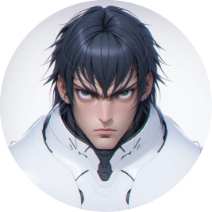

<div align="center">
  

  <h1>🎨 Kakachiex Realtime Canvas</h1>
  
  <p>
    <strong>A high-performance React application for real-time sketch-to-image generation powered by ComfyUI and Flux.</strong>
  </p>

  <p>
    <a href="https://reactjs.org/"></a>
    <a href="https://www.typescriptlang.org/"></a>
    <a href="https://vitejs.dev/"></a>
    <a href="https://tailwindcss.com/"></a>
    
  </p>
</div>

---

## 🚀 Overview

**Kakachiex Realtime Canvas** bridges the gap between rough ideation and beautiful renders. By seamlessly connecting a web-based drawing canvas to a local or remote **ComfyUI** websocket backend, the application transforms your rough sketches into highly detailed, curated material renders in _real-time_.

Whether you are sketching an industrial product, a glossy ceramic toy, or a neon cyberpunk prop, Kakachiex translates your brush strokes through Flux into stunning imagery instantly.

<br />
<div align="center">
  <!-- Placeholder for a beautiful screenshot of the app -->
  
  <p><em>* Replace with an actual screenshot of the Split/Merge workspace.</em></p>
</div>
<br />

## ✨ Key Features

- **🖌️ Low-Latency Sketch Engine**: Smooth, responsive drawing canvas with pressure simulation and multiple brush modes.
- **⚡ Dynamic & Manual Rendering**: Auto-generate images instantly on stroke completion, or toggle into _Manual Mode_ to save GPU resources for lower-end hardware.
- **🎨 Curated Material Styles**: Over 10+ built-in aesthetic profiles including _Studio, Ceramic, Plush, Anime, Neon, Glass,_ and _Sumi-e Fox Ink_.
- **🖥️ Split & Merge Workspaces**: Flexible UI layouts that let you draw side-by-side with your render, or overlay your sketch directly on top of the output.
- **⚙️ Native ComfyUI Websocket**: Deep integration with ComfyUI workflows, supporting custom nodes, Lora injection, and Flux 1024x1024 latent generation.

## 🛠️ Tech Stack

Kakachiex Realtime Canvas is built for modern browser performance:

- **Frontend**: React 18, TypeScript, Vite
- **Styling**: Tailwind CSS, Radix UI Primitives, Lucide Icons
- **APIs**: ComfyUI Websocket Client, Fal.ai Fallback
- **Build**: Node environments with strict ESLint & SWC compiling

## 📦 Installation & Setup

### 1. Requirements

Ensure you have Node.js installed, as well as a running instance of **ComfyUI** configured with the Flux models and necessary custom nodes (like `ImageResizeKJv2` and `comfyui-flux2fun-controlnet`).

### 2. Install Project Dependencies

Clone the repository and install the NPM packages:

```bash
cd realtime-canvas
npm install
```

### 3. Start the Development Server

```bash
npm run dev
```

The application will be running at `http://localhost:5173`.

### 4. Connect to ComfyUI

1. Open the application in your browser.
2. Click the **Settings (Gear Icon)** in the Control Bar.
3. Input your ComfyUI Host URL (usually `http://127.0.0.1:8188`).
4. Make sure your base `Workflow` JSON is loaded or selected from the folder.
5. Click **Connect**.

## 🎮 How to Use

1. **Select a Style**: Open the Style Selector dropdown and choose a material aesthetic (e.g., _Toy_ or _Ceramic_).
2. **Draw**: Paint your sketch on the active canvas.
3. **Generate**: If _Dynamic Rendering_ is enabled, releasing your pen will automatically trigger the render. If _Manual Rendering_ is enabled, press the blue `Render` button.
4. **Compare**: Use the **Split/Merge** toggle to shift between a side-by-side view and a direct composite overlay.

---

<div align="center">
  <p>Built with ❤️ by <a href="https://github.com/kakachiex2">Kakachiex</a>.</p>
</div>
